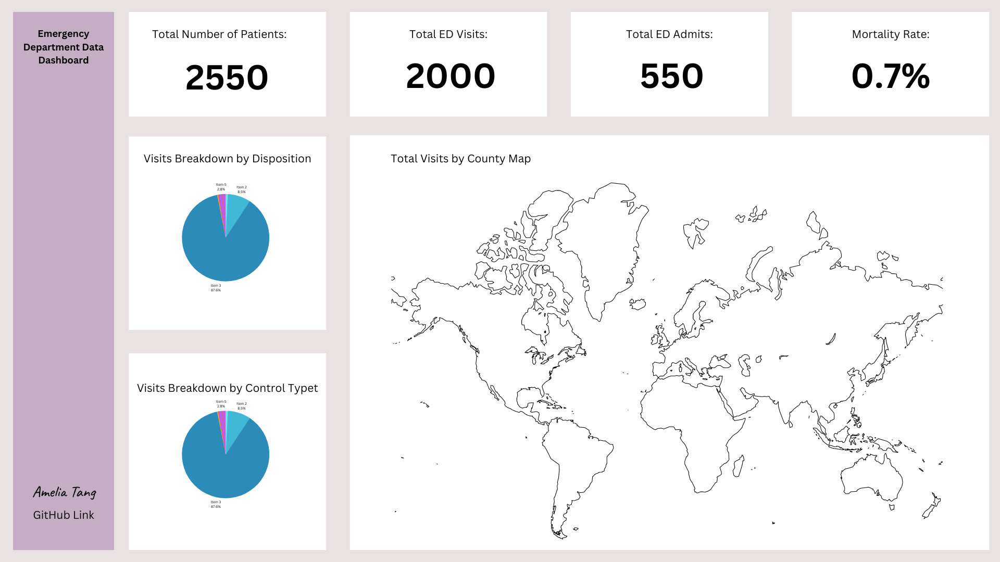
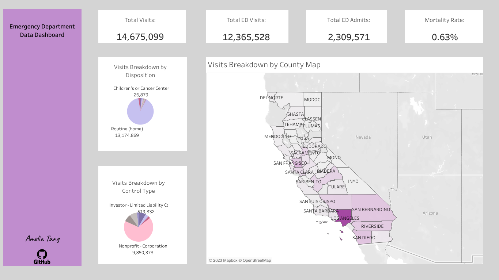

# Hospital Emergency Department Dashboard in Tableau

### Data Overview
The data is collected from the "CA Emergency Department Data" data set available on [data.world](https://data.world/healthdata/ca-emergency-department-data). This data set contains California Emergency Department Data by Disposition for the years 2010-2014. As Tableau Public has a limit of handling 15,000 lines of data, the dashboard I constructed includes only the first 10,000 lines. It's essential to note that since the visualization dashboard is built on a subset of the data, the analysis does not fully reflect reality. This project is intended for demonstration purposes.

The data I used contains information on California Emergency Department data, with a specific focus on disposition. It comprises nine columns:

- oshpd_id: The ID of the facility assigned by the HCAI Office of Statewide Hospital Planning and Development (OSHPD).
- facility_name: The name of the hospital/healthcare facility.
- county_name: The name of the county in California.
- control_type: The ownership type of the healthcare facility, such as nonprofit or public.
- er_service: Indicates the type of ER service provided, such as "basic" or "standby."
- datayear: The year of the data.
- source: Indicates whether the entries correspond to ED admits or ED visits.
- disposition: Represents the destination of the patients after medical treatments.
- count: Indicates the number of visits/patients.

### Proposal
The data has a specific focus on disposition, which pertains to the destinations of patients after receiving medical treatments in the emergency department. Therefore, I'd like to design the dashboard to reflect information in that area. First, in terms of metrics, the total number of visits and their sources are worth noting. To display this information, I have designed three number cards: "Total Visits," "Total ED Visits," and "Total ED Admits." Additionally, one of the dispositions is "died," and I will use this number to calculate the overall mortality rate.

Furthermore, I have created three graphs to visualize the breakdown of visits by disposition, control type, and county. For the first two categories, I plan to use pie charts, while for the breakdown by county, a filled heat map will be more suitable.

Overall, the dashboard's design aims to provide a clear and informative representation of the data, focusing on key metrics and visualizing the breakdowns for better insights. 
#### Proposed Dashboard Sketch

### Final Dashboard in Tableau

The link to Tableau Public is [here](https://public.tableau.com/app/profile/amelia.tang/viz/Emergency_department_data_dashboard/Dashboard)

### Insights and Findings
- Majority visits in the Emergency department were ED visits.
- The majority of visits in the Emergency Department were ED visits.
- The mortality rate in the emergency department in California was low, at about 0.63%.
- The most common disposition of patients was to return home, and the second most common was to Children's or Cancer Centers.
- The majority of patients visited healthcare facilities that were nonprofit corporations and limited liability corporations in California.
 
**NOTE**: Due to the utilization of a subset of the actual data, the analysis may not fully reflect reality. The analysis is primarily for demonstration purposes.

### Future Improvements
- While displaying the actual numbers of ED visits and ED admits provides more details, presenting the figures as percentages of the total visits could offer a better sense of proportion.
- Calculating the mortality rate for each county might provide valuable insights into how healthcare facilities in each region are performing in terms of reducing mortality rates.
